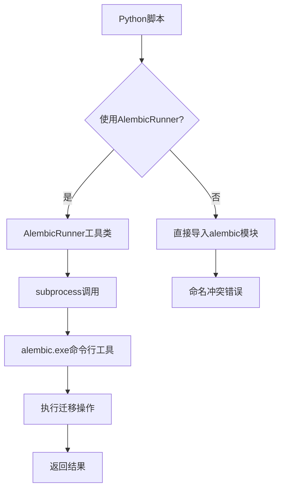

## 问题概述

启动后端服务时遇到数据库迁移错误："No module named 'alembic.config'"，原因是 backend/alembic 目录（项目的迁移脚本目录）与 Python 系统包 alembic 产生命名冲突，导致 Python 解释器从当前目录导入错误的模块。

## 受影响文件

- start_server.py - 启动服务器时的自动迁移功能
- migration_status.py - 检查迁移状态脚本
- migration_helper.py - 迁移助手工具类
- check_db.py - 数据库连接检查脚本
- manual_migrate.py - 手动迁移脚本
- test_migration.py - 迁移测试脚本
- run_migrations.py - 主迁移脚本

## 功能需求

修复所有使用 alembic 模块导入的脚本，确保能够正常运行数据库迁移操作，包括升级、降级、检查状态等功能，同时保持向后兼容性。

## 技术方案

### 核心策略

使用 subprocess 调用 alembic.exe 命令行工具，替代直接导入 alembic 模块，避免命名冲突。

### 实现方法

1. **创建统一的 AlembicRunner 工具类**：封装所有 alembic 命令行操作（upgrade, downgrade, current, history, show, stamp）
2. **更新所有受影响脚本**：替换直接导入为使用 AlembicRunner
3. **保持向后兼容**：所有现有功能和命令行接口保持不变

### 关键设计决策

- **subshell 调用**：通过 subprocess.run() 调用 alembic.exe，避免模块命名空间污染
- **配置文件定位**：使用绝对路径定位 alembic.ini，确保跨目录运行稳定
- **错误处理**：捕获并显示详细错误信息，方便调试
- **编码处理**：修复 Windows 控制台编码问题（GBK vs UTF-8）

### 技术栈

- Python 3.12
- subprocess（标准库）
- os, sys（路径处理）
- Alembic 1.13.1（已安装）

## 架构设计



## 目录结构

```
backend/
├── app/utils/
│   └── alembic_runner.py        # [NEW] 统一的 AlembicRunner 工具类，封装所有 alembic 命令行操作
├── start_server.py              # [MODIFY] 使用 AlembicRunner 替代直接导入
├── migration_status.py          # [MODIFY] 使用 AlembicRunner 替代直接导入
├── migration_helper.py          # [MODIFY] 使用 AlembicRunner 替代直接导入
├── check_db.py                  # [MODIFY] 使用 AlembicRunner 替代直接导入
├── manual_migrate.py            # [MODIFY] 使用 AlembicRunner 替代直接导入
├── test_migration.py            # [MODIFY] 使用 AlembicRunner 替代直接导入
└── run_migrations.py            # [MODIFY] 使用 AlembicRunner 替代直接导入
```

## 实现细节

### 核心文件：app/utils/alembic_runner.py

AlembicRunner 工具类将提供以下方法：

- `current()` - 显示当前数据库版本
- `upgrade(revision="head")` - 升级数据库
- `downgrade(revision="-1")` - 回滚数据库
- `history()` - 显示迁移历史
- `show()` - 显示迁移状态
- `stamp(revision="head")` - 标记数据库版本

内部实现使用 subprocess 调用 alembic.exe，避免命名冲突。

### 修改要点

1. 所有脚本移除 `from alembic.config import Config` 和 `from alembic import command` 导入
2. 改为 `from app.utils.alembic_runner import AlembicRunner`
3. 调用方式从 `command.upgrade(alembic_cfg, "head")` 改为 `AlembicRunner().upgrade()`
4. Windows 控制台编码问题：使用 `io.TextIOWrapper` 包装 stdout/stderr

### 性能考虑

- subprocess 调用会产生进程启动开销，但迁移操作通常不频繁，可接受
- 避免了复杂的模块导入冲突处理逻辑，代码更简洁可靠