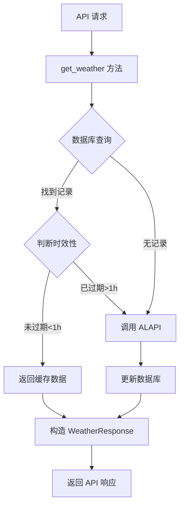

## 产品概述

优化天气接口实现，通过数据库缓存机制减少对第三方天气 API 的频繁调用，提升接口性能和可靠性。

## 核心功能

- 优先从数据库缓存获取天气数据
- 自动判断数据时效性（超过 1 小时自动更新）
- 保持原有 API 响应格式不变
- 添加适当的日志记录缓存命中情况

## 技术栈

- 后端框架: FastAPI + Python
- 数据库: SQLAlchemy ORM (支持 PostgreSQL/SQLite)
- 第三方 API: ALAPI 天气接口
- 日志: 自定义 app_logger

## 实现方案

### 系统架构

采用缓存优先的天气数据获取策略，在服务层实现数据库缓存逻辑，通过依赖注入获取数据库 session，对外保持 API 响应格式不变。



### 核心修改

#### 1. WeatherService 类改造

- 移除全局单例 `weather_service = WeatherService()`
- 修改 `get_weather` 方法签名，接收 `db: Session` 参数
- 添加缓存查询和时效性判断逻辑
- 添加数据转换方法：`_response_to_model` 和 `_model_to_response`

#### 2. API 端点改造

- 修改 `weather.py` (endpoints)，通过 `Depends(get_db)` 注入数据库 session
- 调用 `weather_service.get_weather(db, city)` 替代 `weather_service.get_weather(city)`

### 数据流

1. 请求到达 API 端点
2. 通过依赖注入获取数据库 session
3. 调用服务层获取天气数据（含缓存逻辑）
4. 服务层优先查询数据库，判断数据时效性
5. 数据过期时调用第三方 API 并更新数据库
6. 构造统一的 WeatherResponse 格式返回

### 时效性判断

使用 Python datetime 模块，计算当前时间与 `updated_at` 的差值，超过 3600 秒（1小时）视为过期。

### 关键技术决策

- **缓存粒度**: 按城市维度缓存，每个城市一条最新记录
- **更新策略**: 惰性更新，只在请求时检查时效性
- **兼容性**: 保持 API 响应格式不变，前端无需修改
- **降级处理**: 数据库查询失败时，直接调用第三方 API

## 实施细节

### 文件修改清单

```
backend/
├── app/services/weather_service.py    # [MODIFY] 添加缓存逻辑和数据转换方法
└── app/api/v1/endpoints/weather.py   # [MODIFY] 注入数据库 session
```

### 核心代码结构

#### WeatherService.get_weather 方法签名

```python
async def get_weather(self, db: Session, city: str) -> WeatherResponse:
    # 查询数据库缓存
    db_weather = get_weather_by_city(db, city)
    
    # 判断时效性
    if db_weather and not self._is_expired(db_weather):
        return self._model_to_response(db_weather)
    
    # 调用第三方 API
    response = await self._fetch_from_api(city)
    
    # 保存到数据库
    self._save_to_db(db, response.data)
    
    return response
```

### 性能考虑

- **数据库索引**: 已有 `idx_weather_city_updated` 复合索引，查询性能优化
- **连接池**: 使用 SQLAlchemy 连接池，避免频繁创建连接
- **缓存命中**: 有效缓存可完全避免第三方 API 调用
- **异常处理**: 数据库异常时降级到 API 调用，确保服务可用性

### 日志策略

- 缓存命中: 记录城市名称和缓存时间
- 缓存过期: 记录需要更新
- API 调用: 记录第三方请求情况
- 数据库更新: 记录保存操作

### 向后兼容

- API 端点路径不变
- 请求/响应格式不变
- 数据库 schema 不变（已有字段足够）